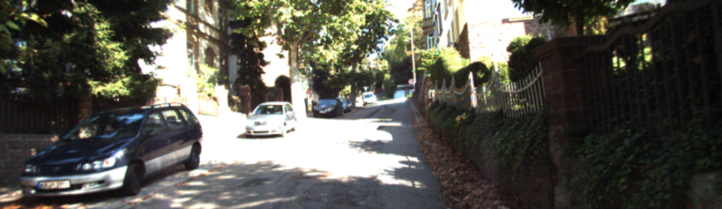

# An Adaptive Framework for Learning Unsupervised Depth Completion

PyTorch implementation of *An Adaptive Framework for Learning Unsupervised Depth Completion*

Project AdaFrame: Ada(ptive) Frame(work) for Depth Completion

Published in RA-L January 2021 and ICRA 2021

[[publication]](https://ieeexplore.ieee.org/document/9351588)

Model have been tested on Ubuntu 16.04, 20.04 using Python 3.5, 3.6, PyTorch 1.2.0

Authors: [Alex Wong](http://web.cs.ucla.edu/~alexw/), [Xiaohan Fei](https://feixh.github.io/)

If this work is useful to you, please cite our paper:
```
@article{wong2021adaptive,
    title={An Adaptive Framework for Learning Unsupervised Depth Completion},
    author={Wong, Alex and Fei, Xiaohan and Hong, Byung-Woo and Soatto, Stefano},
    journal={IEEE Robotics and Automation Letters},
    volume={6},
    number={2},
    pages={3120--3127},
    year={2021},
    publisher={IEEE}
}
```

**Table of Contents**
1. [About sparse-to-dense depth completion](#about-sparse-to-dense)
2. [About AdaFrame](#about-adaframe)
3. [Related projects](#related-projects)
4. [License and disclaimer](#license-disclaimer)

## About sparse-to-dense depth completion <a name="about-sparse-to-dense"></a>
In the sparse-to-dense depth completion problem, we seek to infer the dense depth map of a 3-D scene using an RGB image and its associated sparse depth measurements in the form of a sparse depth map, obtained either from computational methods such as SfM (Strcuture-from-Motion) or active sensors such as lidar or structured light sensors.

| *RGB image from the VOID dataset*    | *Our densified depth map -- colored and backprojected to 3D* |
| :----------------------------------------: | :--------------------------------------------------------: |
|  |  |

| *RGB image from the KITTI dataset*    | *Our densified depth map -- colored and backprojected to 3D* |
| :-----------------------------------------: | :--------------------------------------------------------: |
|  |  |

To follow the literature and benchmarks for this task, you may visit:
[Awesome State of Depth Completion](https://github.com/alexklwong/awesome-state-of-depth-completion)

## About AdaFrame <a name="about-adaframe"></a>
A number of computer vision problems can be formulated as an energy function which consists of the linear combination of a data fidelity (fitness to data) term and a regularizer (bias or prior). The data fidelity is weighted uniformly by a scalar &alpha; and the regularizer by &gamma; that determine their relative significance.

However, uniform static &alpha; does not account for visibility phenomenon (occlusions) and uniform static &gamma; does may impose too much or too little regularization. We propose an adaptive framework (&alpha; and &gamma;) that consists of weighting schemes that vary spatially (image domain) and temporally (over training time) based on the residual or fitness of model to data.

**&alpha;** starts by weighting all pixel locations approximately uniformly and gradually downweights regions with high residual over time. &alpha; is conditioned on the mean or global residual, as the model become better fitted to the data, we become more confident that the high residual regions be results of occlusions yielding a sharper curve over time. Here is a visualization of &alpha;:

<p align="center">
    
</p>

**&gamma;** starts by imposing a low degree of regularization and only increase regularization where appropriate based on the fitness of the model to the data. Here is a visualization of &gamma;:

<p align="center">
    
</p>

We note that alpha and gamma are complementary. Ill-posed regions such as occlusions cannot be uniquely determined by the data and hence we need regularization. So, gamma increases regularization around ill-posed regions allowing neighboring point estimates that fit the data well to fill them in the gaps.

## Source code coming soon!
We apologize for the delay, we want to release the PyTorch implementation in conjunction to an update to [VOICED][voiced_github].

## Related projects <a name="related-projects"></a>
You may also find the following projects useful:

- [ScaffNet and FusionNet][scaffnet_fusionnet_github]: *Learning Topology from Synthetic Data for Unsupervised Depth Completion.* An unsupervised sparse-to-dense depth completion method that learns to map sparse geometry to dense topology from synthetic data and refines the initial estimate with real image. This work is published in the Robotics and Automation Letters (RA-L) 2021 and the International Conference on Robotics and Automation (ICRA) 2021.
- [VOICED][voiced_github]: *Unsupervised Depth Completion from Visual Inertial Odometry*. An unsupervised sparse-to-dense depth completion method, developed by the authors. The paper introduces Scaffolding for depth completion and a light-weight network to refine it. This work is published in the Robotics and Automation Letters (RA-L) 2020 and the International Conference on Robotics and Automation (ICRA) 2020.
- [VOID][void_github]: from *Unsupervised Depth Completion from Visual Inertial Odometry*. A dataset, developed by the authors, containing indoor and outdoor scenes with non-trivial 6 degrees of freedom. The dataset is published along with this work in the Robotics and Automation Letters (RA-L) 2020 and the International Conference on Robotics and Automation (ICRA) 2020.
- [XIVO][xivo_github]: The Visual-Inertial Odometry system developed at UCLA Vision Lab. This work is built on top of XIVO. The VOID dataset used by this work also leverages XIVO to obtain sparse points and camera poses.
- [GeoSup][geosup_github]: *Geo-Supervised Visual Depth Prediction*. A single image depth prediction method developed by the authors, published in the Robotics and Automation Letters (RA-L) 2019 and the International Conference on Robotics and Automation (ICRA) 2019. This work was awarded **Best Paper in Robot Vision** at ICRA 2019.
- [AdaReg][adareg_github]: *Bilateral Cyclic Constraint and Adaptive Regularization for Unsupervised Monocular Depth Prediction.* A single image depth prediction method that introduces adaptive regularization. This work was published in the proceedings of Conference on Computer Vision and Pattern Recognition (CVPR) 2019.

We also have works in adversarial attacks on depth estimation methods:
- [Stereopagnosia][stereopagnosia_github]: *Stereopagnosia: Fooling Stereo Networks with Adversarial Perturbations.* Adversarial perturbations for stereo depth estimation, published in the Proceedings of AAAI Conference on Artificial Intelligence (AAAI) 2021.
- [Targeted Attacks for Monodepth][targeted_attacks_monodepth_github]: *Targeted Adversarial Perturbations for Monocular Depth Prediction.* Targeted adversarial perturbations attacks for monocular depth estimation, published in the proceedings of Neural Information Processing Systems (NeurIPS) 2020.

[kitti_dataset]: http://www.cvlibs.net/datasets/kitti/
[vkitti_dataset]: https://europe.naverlabs.com/research/computer-vision/proxy-virtual-worlds-vkitti-1/
[scenenet_dataset]: https://robotvault.bitbucket.io/scenenet-rgbd.html
[void_github]: https://github.com/alexklwong/void-dataset
[voiced_github]: https://github.com/alexklwong/unsupervised-depth-completion-visual-inertial-odometry
[scaffnet_fusionnet_github]: https://github.com/alexklwong/learning-topology-synthetic-data
[xivo_github]: https://github.com/ucla-vision/xivo
[geosup_github]: https://github.com/feixh/GeoSup
[adareg_github]: https://github.com/alexklwong/adareg-monodispnet
[stereopagnosia_github]: https://github.com/alexklwong/stereopagnosia
[targeted_attacks_monodepth_github]: https://github.com/alexklwong/targeted-adversarial-perturbations-monocular-depth

## License and disclaimer <a name="license-disclaimer"></a>
This software is property of the UC Regents, and is provided free of charge for research purposes only. It comes with no warranties, expressed or implied, according to these [terms and conditions](license). For commercial use, please contact [UCLA TDG](https://tdg.ucla.edu).
